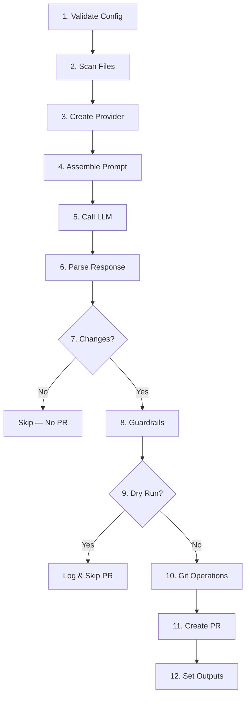

# Architecture

How Prompt2PR works internally.

---

## Pipeline Overview

Prompt2PR runs a 13-step pipeline from configuration to Pull Request:



## Step Details

### 1. Validate Configuration

Reads all inputs from the GitHub Actions environment via `@actions/core`.
Validates required fields (`prompt`, `provider`), resolves the API key from
environment variables, and masks it as a secret in logs.

### 2. Scan Files

Uses `@actions/glob` to find files matching the `paths` input. Filters out:

- The `.github/` directory (always excluded for safety)
- Binary files (detected by extension)
- Directories

Tracks total file size for context budget calculations.

### 3. Create Provider

Factory pattern selects the correct LLM provider class based on the `provider`
input. Three providers (Mistral, OpenAI, GitHub Models) share a common base
class for OpenAI-compatible APIs. Anthropic has a standalone implementation due
to its different API format.

### 4. Assemble Prompt

Builds a structured chat request with:

- **System message** — Instructions for the LLM to respond in a specific JSON
  format with file changes
- **User message** — The user's prompt + contents of all scanned files

The assembler manages a 200,000-character context budget. If files exceed this
limit, it truncates content and logs a warning. Files that don't fit are
excluded entirely.

### 5. Call LLM

Sends the chat request to the provider's API. Includes automatic retry: if the
first call fails, it retries once after a 5-second backoff. The retry preserves
error types (e.g., `ProviderError` stays a `ProviderError`).

### 6. Parse Response

Validates the LLM's response structure. Expects a JSON object with:

```json
{
  "files": [
    {
      "path": "src/example.ts",
      "content": "// new file content",
      "action": "modify"
    }
  ],
  "summary": "Optional description of changes"
}
```

Each file entry must have `path` (string), `content` (string), and `action`
(`"create"`, `"modify"`, or `"delete"`).

### 7. Check for Changes

If the LLM returns zero file changes, the run ends early. The `skipped` output
is set to `"true"`.

### 8. Guardrails

Post-LLM safety validation. Checks (in order):

1. **Path traversal** — Rejects paths containing `..`
2. **`.github/` exclusion** — Blocks modifications to `.github/` files
3. **Path scope** — Ensures all changed files match the `paths` globs (uses
   `picomatch` for validation)
4. **`max_files`** — Rejects if more files changed than allowed
5. **`max_changes`** — Rejects if total lines changed exceeds the limit

If any check fails, the run errors with a `GuardrailError`.

### 9. Dry Run Check

If `dry_run: true`, the pipeline logs what would have changed and sets outputs
(`files_changed`, `lines_changed`, `skipped: true`) without creating a branch or
PR.

### 10. Git Operations

Using `@actions/exec` to run Git commands:

1. Creates a new branch: `{branch_prefix}{timestamp}`
2. Applies file changes (create, modify, or delete)
3. Stages all changes
4. Commits with a message including the prompt
5. Pushes the branch to the remote

### 11. Create Pull Request

Uses Octokit (GitHub's REST API client) to create a PR. The PR body includes:

- The original prompt
- AI-generated summary (if the LLM provided one)
- List of changed files with actions
- Metadata table (provider, model, files changed, lines changed)

Applies the configured labels.

### 12. Set Outputs

Sets all action outputs (`pr_url`, `pr_number`, `files_changed`,
`lines_changed`, `skipped`) for use by downstream steps.

---

## Error Handling

Prompt2PR uses typed errors for different failure modes:

| Error Type       | When It Occurs                                        |
| :--------------- | :---------------------------------------------------- |
| `ConfigError`    | Invalid or missing inputs, missing API key            |
| `ProviderError`  | LLM API failures (auth, rate limit, timeout, network) |
| `ParseError`     | LLM response is malformed or missing required fields  |
| `GuardrailError` | Changes violate safety limits                         |
| `GitError`       | Git operations fail (branch, commit, push)            |

All errors are logged with structured context (component name, error details)
and set the action as failed via `@actions/core.setFailed()`.

---

## Project Structure

```text
src/
├── index.ts                 # Entry point
├── main.ts                  # Pipeline orchestrator
├── config.ts                # Input validation
├── file-scanner.ts          # Glob-based file scanning
├── prompt-assembler.ts      # Prompt + context assembly
├── response-parser.ts       # LLM response validation
├── guardrails.ts            # Post-LLM safety checks
├── git-manager.ts           # Git operations
├── pr-creator.ts            # GitHub PR creation
├── logger.ts                # Structured logging
├── errors.ts                # Typed error classes
├── retry.ts                 # Retry with backoff
└── providers/
    ├── types.ts                         # Shared interfaces
    ├── provider-factory.ts              # Factory pattern
    ├── base-openai-compatible-provider.ts  # Shared base class
    ├── mistral-provider.ts              # Mistral implementation
    ├── openai-provider.ts               # OpenAI implementation
    ├── anthropic-provider.ts            # Anthropic implementation
    └── github-models-provider.ts        # GitHub Models implementation
```

---

Next: [Troubleshooting]()
